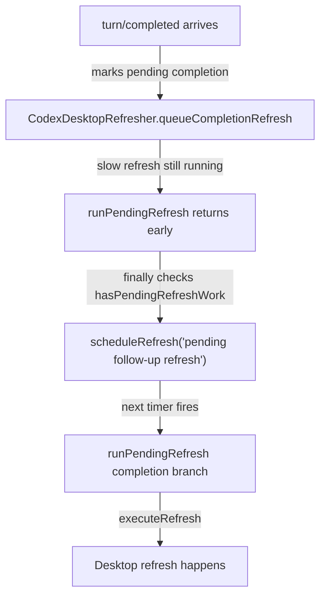
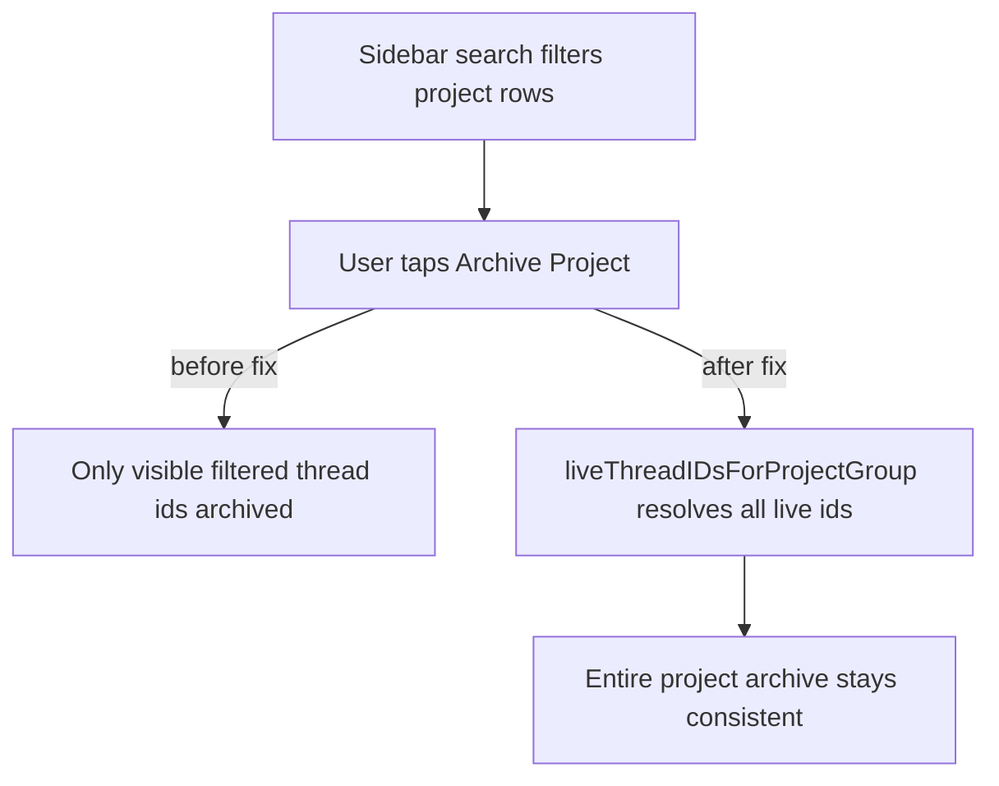

# Recap: Review Finding Fixes
> Generated: 2026-03-10  |  Scope: 6 files

---

## Summary

This task fixed the two regressions found in review. The desktop refresher now retries queued completion refreshes after a slow in-flight refresh finishes, and project archiving in the iOS sidebar now archives the whole live project even when the sidebar is filtered by search. The result is that both flows now match the intended user behavior instead of depending on timing or temporary UI filters.

---

## Files Affected

| File | Status | Role |
|---|---|---|
| `phodex-bridge/src/codex-desktop-refresher.js` | ✏️ Modified | Keeps pending completion refreshes alive until they actually run |
| `phodex-bridge/test/codex-desktop-refresher.test.js` | ✏️ Modified | Covers the slow-refresh + queued-completion regression |
| `CodexMobile/CodexMobile/Views/Sidebar/SidebarThreadGrouping.swift` | ✏️ Modified | Adds a pure helper to resolve full live project membership |
| `CodexMobile/CodexMobile/Views/SidebarView.swift` | ✏️ Modified | Uses the full project membership when archiving from the sidebar |
| `CodexMobile/CodexMobileTests/SidebarThreadGroupingTests.swift` | ✏️ Modified | Adds coverage for filtered-project and no-project archive resolution |

---

## Logic Explanation

### Problem
The first bug came from the desktop refresh queue tracking two kinds of pending work but only re-scheduling one of them. The second bug came from using a filtered sidebar group as if it still represented the full project.

### Approach
The fix keeps both problems in pure, local logic. The refresher now asks one helper whether any work is still pending, and the sidebar now resolves archive membership from the complete thread list instead of trusting the visible subset.

### Step-by-step
1. `CodexDesktopRefresher` now uses `hasPendingRefreshWork()` both before running and after finishing a refresh. This means a queued completion refresh survives the case where its timer fires during another slow refresh.
2. A new test simulates exactly that slow-refresh timing. It verifies that the completion refresh runs after the first refresh is released.
3. `SidebarThreadGrouping.liveThreadIDsForProjectGroup(...)` now rebuilds the project membership from the full thread list. It matches on the stable project group id, so filtered groups and the `No Project` bucket still resolve to the correct live chats.
4. `SidebarView.archivePendingProjectGroup()` now uses those resolved ids and checks the selected thread against the full archived set. This keeps the action aligned with the dialog copy that says the whole project will be archived.

### Tradeoffs & Edge Cases
The sidebar fix intentionally resolves only live threads, so archived chats stay untouched even if the group was built from mixed UI state elsewhere. I did not run Xcode tests because this repo’s guardrails say not to run Xcode builds/tests unless explicitly requested, but the added Swift tests cover the new pure helper logic.

---

## Flow Diagram

### Happy Path

### Error Path

---

## High School Explanation

Imagine one bug like an elevator with two request buttons. Someone pressed the second button while the elevator was still moving, but the old code only checked one button when deciding whether to come back. So the second person got ignored. Now the code checks both buttons before walking away.

The sidebar bug was like searching your photo gallery for one picture from a trip, then pressing "delete whole trip" but only deleting the photos currently visible on screen. The fix goes back to the full album first, finds every photo from that trip, and only then applies the delete action.
